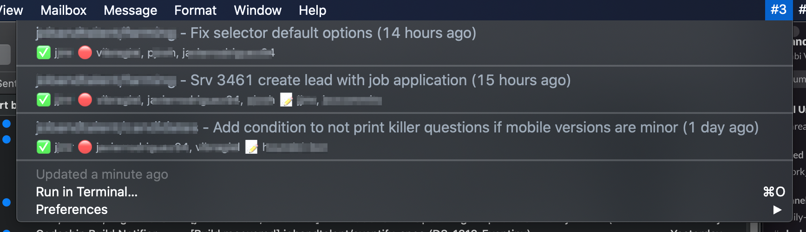
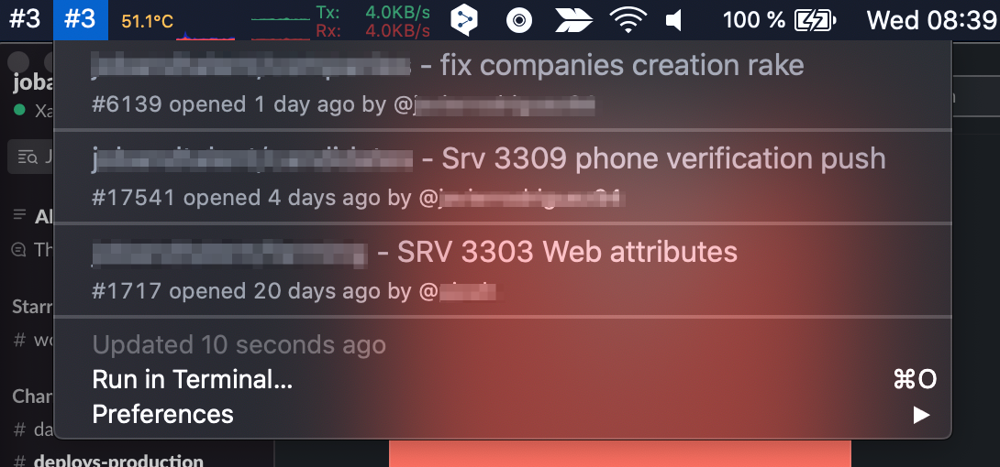
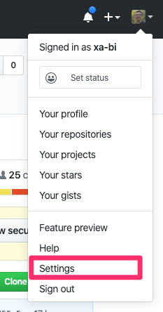
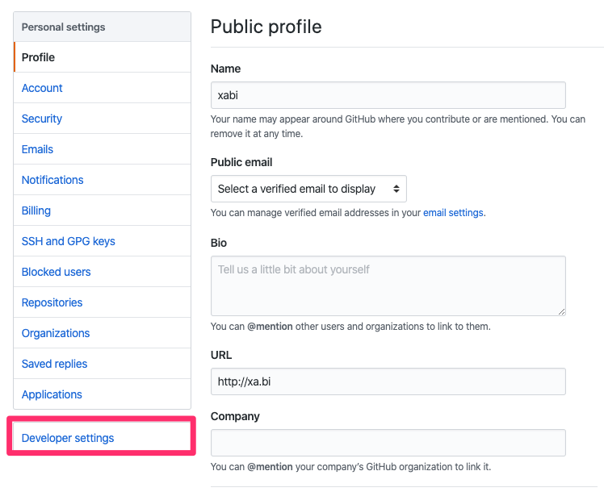
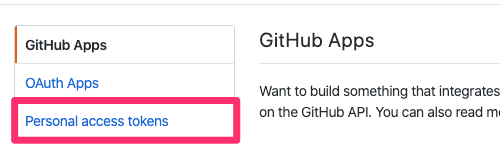
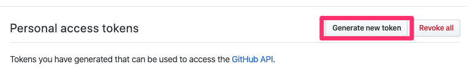
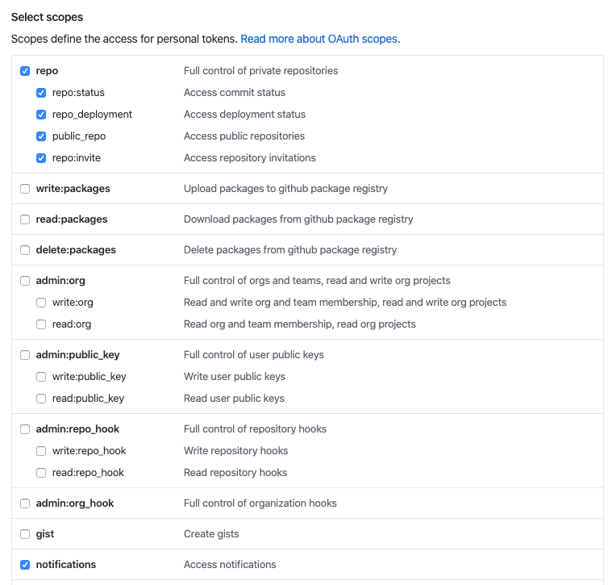

# BITBAR-GITHUB

This repository holds the code [bitbar](https://getbitbar.com/) github plugins.

These plugins help you to have your PRs under control. Two plugins are included in this repo:

## github-pending-prs.py

This plugin will show you all your opened PRs and the state of the review. Github PR page will be opened if you ckick on it.



## github-review-requests.py

This plugin will show you all the PRs witing for your review. Github PR page will be opened if you ckick on it.



## What is bitbar?

Bitbar is a simple (and clever) piece of software which adds a menu in the osx menubar where installed plugins showns it's output.

## Installing bitbar

### OSX

```sh
$ brew cask install bitbar
```

Or you can download the latest release from the [official site](https://getbitbar.com/)

Once downloaded and installed in the Application folder you must configure the plugins directory. I use ```~/Documents/bitbar/```

### Linux

Linux has its own version of bitbar called [Argos](https://github.com/p-e-w/argos)

Please refer to its page for [installing instructions](https://github.com/p-e-w/argos#installation)

## Installing plugins

### Clone this repo in your bitbar plugin directory.

In the sample code I used my previous configured bitbar plugin directory

```sh
$ cd ~/Documents/bitbar/
$ git clone git@github.com:xa-bi/bitbar-github.git
```

### Configure plugins

You must create a config file called `github-config.json` using the provided `SAMPLE.github-config.json` file. Once created you must edit the config file and add your github personal access token (see [below](#getting-a-github-access-token) how to get one) and your github user

```sh
$ cd bitbar-github
$ cp SAMPLE.github-config.json github-config.json
$ vi github-config.json
```

This is the format of the github-config.json

```json
{
  "GITHUB_ACCESS_TOKEN" : "xxxxxxxxxxxxxxxxx",
  "GITHUB_LOGIN" : "foobar"
}
```

* Simlink plugins in the bitbar plugin directory

Bitbar executes the plugins found in the plugin directory each time especified period provided in the plugin filename this way: `{plugin_file_name}.{time}.{ext}` where `{time}` uses this format:

- `XXd` for days. `5d` is each 5 days
- `XXh` for hours. `4d` is each 4 hours
- `XXm` for minutes. `7d` is each 5 minutes
- `XXs` for seconds. `12s` is each 12 seconds

So a plugin called `foo.6m.py` will be refreshed every 6 minutes.

More info about [bitbar plugins](https://github.com/matryer/bitbar)

```sh
$ cd ~/Documents/bitbar/
$ ln -s bitbar-github/github-pending-prs.py github-pending-prs.5m.py
$ ln -s bitbar-github/github-review-requests.py github-review-requests.5m.py
```

## Getting a github access token

Go to your profile Menu



Click on Developer settings



Click on Personal Access Tokens



Click on generate token



Select Scopes



Copy the generated Personal Access Token
